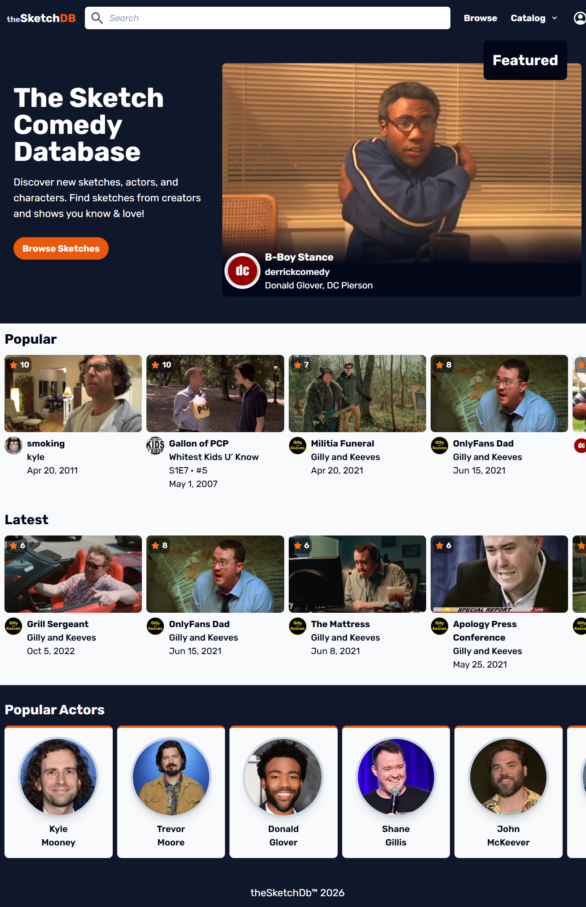
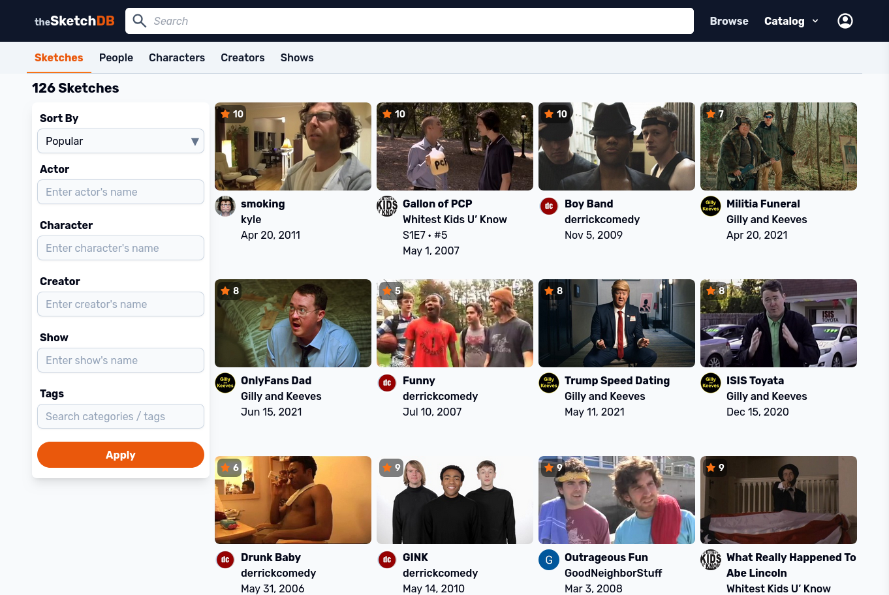

# theSketchDb

[theSketchDb](https://thesketchdb.com) is a website for cataloging sketch comedy content (sketches, people, characters, creators, shows, seasons, and episodes). The public site is built with Go, PostgreSQL, Tailwind, htmx and vanilla JS. 

Users can filter for sketches. Check it out [here](thesketchdb.com/catalog)!

The React CMS was built to facilitate inputting data and integrating AI tooling.
